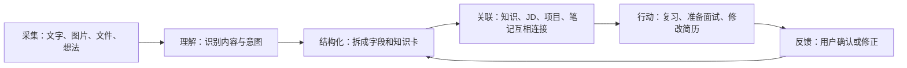
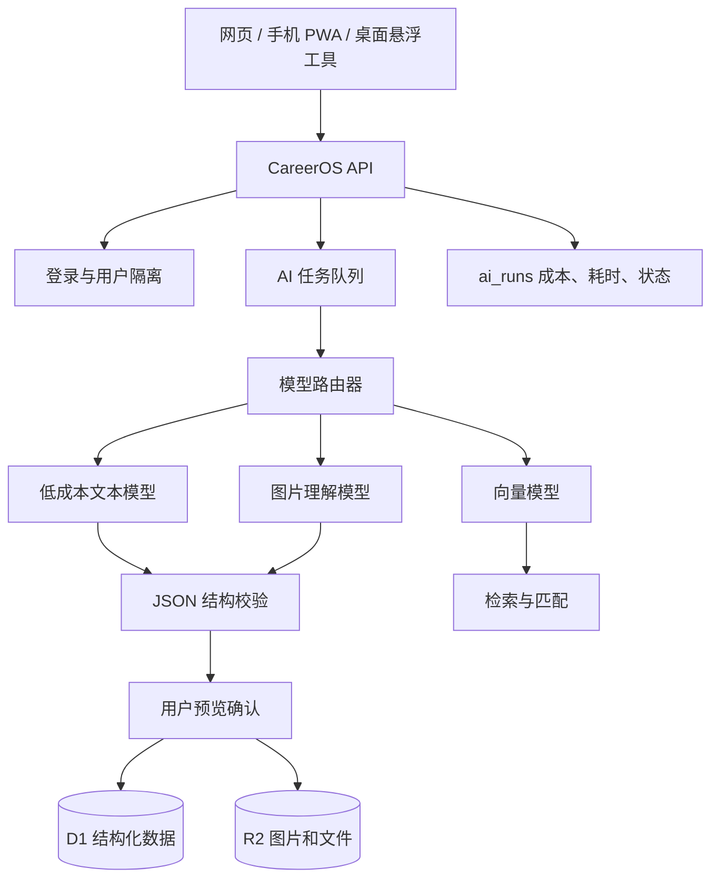

# CareerOS AI 功能产品设计方案

> 版本：V1.0　｜　更新时间：2026-08-01　｜　状态：已完成方案设计，等待分阶段开发

## 1. 产品目标

CareerOS 的 AI 不只是一个聊天框，而是一套贯穿求职过程的“个人信息整理助手”：



设计原则：

- 原始内容永远保留，AI 结果是可修改的草稿，不自动覆盖用户数据。
- 每一条 AI 结论尽量能追溯到原文、图片或个人项目证据。
- 先完成文字版核心闭环，再加入图片识别、桌面悬浮和高级知识库。
- 不用一个昂贵的大模型完成所有工作；按任务难度选择不同模型。

## 2. 需求整理与开发优先级

| 优先级 | 功能 | 用户价值 | 建议阶段 |
|---|---|---|---|
| P0 | 技术名词生成结构化知识点 | 把零碎提问沉淀为可复习知识 | AI MVP |
| P0 | 粘贴文字/上传图片，一键整理知识 | 快速收集外部内容 | AI MVP |
| P0 | 文字/截图 JD 自动整理 | 看懂岗位、能力和准备方向 | AI MVP |
| P0 | 随手记智能分类、整理与任务提取 | 想法先记下来，确认后转成可执行任务 | AI MVP |
| P1 | JD 与个人项目匹配 | 找到最适合写入简历的项目证据 | 升级版 1 |
| P1 | 生成针对性简历项目描述 | 提高投递效率，但必须防止编造 | 升级版 1 |
| P1 | 手机网页/PWA 与数据同步 | 随时采集和查看 | 升级版 1 |
| P2 | Windows 桌面悬浮记录工具 | 降低记录成本 | 升级版 2 |
| P2 | 知识检索增强、关联图谱、复习计划 | 形成长期个人知识库 | 升级版 2 |

说明：参考链接目前无法被自动读取，因此悬浮工具的设计只采用你明确提出的特征：桌面常驻、置顶、可拖动、可缩小和快速记录，不推测原视频中的其他功能。

## 3. 知识模块

### 3.1 两个入口

1. **询问并生成知识**：输入“RAG 是什么”“API 网关有什么用”等问题，AI 生成完整知识卡。
2. **新建知识**：粘贴外部文字，或上传截图/照片；系统先提取内容，再整理成知识卡。

两个入口最终保存为同一种知识数据，因此后续可以统一搜索、复习和关联。

### 3.2 知识卡结构

| 英文字段 | 中文含义 | 展示内容 |
|---|---|---|
| `title` | 知识点标题 | 例如“RAG（检索增强生成）” |
| `one_line_definition` | 一句话定义 | 用最短的话先讲清楚是什么 |
| `aliases` | 别名 | 中文名、英文名、缩写 |
| `category` | 分类 | AI、数据库、产品、后端等 |
| `why_it_matters` | 为什么重要 | 与工作或当前项目的关系 |
| `core_concepts` | 核心概念 | 拆解必须理解的组成部分 |
| `how_it_works` | 工作原理 | 按步骤解释运行过程 |
| `use_cases` | 使用场景 | 什么情况下应该使用 |
| `example` | 实际例子 | 优先结合 CareerOS 解释 |
| `workflow` | 实施流程 | 从输入到输出的完整步骤 |
| `advantages` | 优点 | 能解决什么问题 |
| `limitations` | 局限 | 不能解决什么、有什么成本 |
| `common_mistakes` | 常见误区 | 容易理解错或做错的地方 |
| `interview_questions` | 面试题 | 问题、回答要点和追问 |
| `related_topics` | 相关知识 | 可继续学习的知识点 |
| `review_cards` | 复习卡片 | 正面问题、背面答案 |
| `sources` | 来源 | 原始文字、图片、网址或文件 |
| `confidence` | 可信度提示 | 已有来源、AI 推断、待核实 |

### 3.3 使用流程

1. 用户输入问题、文字或图片。
2. 图片先做文字/视觉识别，并保留原图；文字保留原文。
3. AI 判断主题、难度和已有信息是否足够。
4. AI 严格按知识卡 JSON 结构输出。
5. 后端校验字段，前端展示“保存前预览”。
6. 用户可以修改、补问、保存或放弃。
7. 后续补问作为新的知识来源，生成新版本，不覆盖旧版本。

### 3.4 复习设计

- 每张知识卡自动生成 3—8 张问答卡。
- 支持“不会 / 模糊 / 掌握”三个反馈。
- 第一版只做待复习列表；升级版再加入间隔复习算法。
- 知识卡可关联 JD：例如多个 JD 都出现 RAG，系统显示“该能力被 8 个收藏岗位要求”。

## 4. 求职模块

### 4.1 JD 自动整理

支持粘贴文字和上传一张或多张截图。处理链路为：识别原文 → 去除招聘软件噪声 → 识别重复岗位 → 结构化 → 生成准备建议。

JD 结果应包含：

| 英文字段 | 中文含义 | 说明 |
|---|---|---|
| `job_title` | 岗位名称 | 完整显示，不省略 |
| `company` | 公司 | 无法识别时标记待填写 |
| `location` | 工作地点 | 城市、远程或混合办公 |
| `role_summary` | 岗位一句话总结 | 这个岗位主要干什么 |
| `job_family` | 岗位分类 | AI 产品、数据产品、运营等 |
| `seniority` | 职级 | 实习、初级、中级等 |
| `business_domain` | 业务领域 | 电商、企业服务、内容等 |
| `responsibilities` | 工作职责 | 日常要完成的工作 |
| `must_have` | 必备能力 | 明确要求、优先级高 |
| `nice_to_have` | 加分项 | 有更好但不是硬门槛 |
| `technical_skills` | 技术能力 | SQL、API、RAG、数据分析等 |
| `business_skills` | 业务能力 | 需求分析、指标设计、协作等 |
| `deliverables` | 交付物 | 方案、原型、数据看板、上线结果等 |
| `unclear_points` | 模糊信息 | 原 JD 没说清、面试需要确认的点 |
| `gap_analysis` | 差距分析 | 已具备、可证明、待补齐 |
| `preparation_plan` | 准备计划 | 立即、7 天、30 天三个层级 |
| `source_evidence` | 原文证据 | 每项判断对应的 JD 原句 |

大量 JD 进入系统后，可以按岗位族、行业、技能和地点自动聚类，并统计“高频能力”。这比单纯保存招聘截图更能帮助用户判断学习优先级。

### 4.2 JD 与个人项目匹配

该功能不能直接拿“资料文件名”做匹配，需要先把个人项目整理为项目档案：项目背景、目标、个人职责、使用技术、业务动作、结果数据和可验证材料。

建议匹配分数：

- 技能重合度：30%。
- 业务场景相关度：25%。
- 结果与数据证据：20%。
- 个人职责相关度：15%。
- 行业相关度：10%。

模型负责理解语义和解释理由，最终分数由明确规则计算，避免模型随意打分。结果需要展示“为什么匹配”“缺少什么证据”“如何补强”，不能只显示一个百分比。

### 4.3 简历内容生成

输出三种内容：

1. 一句话项目摘要。
2. 2—4 条简历要点，使用“动作 + 方法 + 结果”的结构。
3. 面向当前 JD 的项目介绍和面试讲述稿。

防编造规则：

- 只能使用项目档案中已经确认的事实。
- 缺失数据用“待补充”提示，禁止自动创造增长率、用户数或业务结果。
- 每句话都能查看它来自哪条项目证据。
- 生成后必须由用户确认，才能保存为正式简历版本。

## 5. 随手记与桌面悬浮工具

### 5.1 AI 整理能力

用户记录后先立即保存，再后台整理，不能让 AI 响应时间阻塞记录。AI 可输出：建议标题、摘要、类型、标签、所属模块、任务候选、截止时间（仅原文明确时）、相关知识/JD，以及是否需要用户处理。

用户可以选择“接受全部”“只接受分类”“撤销整理”。原始笔记始终保留。

### 5.2 从随手记创建任务

AI 需要把笔记中的内容分成三类：

- **明确任务**：例如“周五之前修改简历”，建议直接进入确认列表。
- **潜在任务**：例如“感觉应该学一下 API”，标记为可能的任务，由用户判断。
- **普通记录**：例如“今天理解了 API 的含义”，只整理笔记，不创建任务。

处理流程：

1. AI 从一条笔记中提取零个、一个或多个任务候选。
2. 每个候选包含任务标题、说明、截止时间、优先级、分类和判断依据。
3. 页面显示“发现 N 个任务”，用户可以逐条勾选、修改或忽略。
4. 用户确认后才调用任务 API 创建正式任务；AI 不得静默写入任务列表。
5. 新任务保存 `source_note_id`（来源笔记编号）和 `ai_run_id`（本次 AI 整理编号）。
6. 任务详情可以返回原笔记，笔记也显示已创建的关联任务；删除其中一方不会自动删除另一方。

建议的任务候选结构：

| 英文字段 | 中文含义 | 规则 |
|---|---|---|
| `title` | 任务标题 | 使用可执行动作开头 |
| `description` | 任务说明 | 保留必要背景，不复制整篇笔记 |
| `due_at` | 截止时间 | 原文没有明确时间时必须为空 |
| `priority` | 优先级 | 高、中、低，并说明判断原因 |
| `category` | 任务分类 | 求职、学习、项目、生活等 |
| `confidence` | 判断可信度 | 明确任务、潜在任务或不确定 |
| `evidence_text` | 原文依据 | 展示 AI 从哪句话提取任务 |

任务创建后可以进一步选择“加入今日”，但第一版不自动安排日程。这样既能减少遗漏，也避免 AI 把普通想法全部变成任务。

### 5.3 悬浮工具交互

桌面工具分为三种状态：

- **悬浮球**：只占很小空间，单击打开，支持拖动。
- **快速记录框**：输入文字、粘贴图片，按快捷键保存。
- **展开编辑器**：查看 AI 分类结果、补充内容、进入 CareerOS 主站。

应支持始终置顶、置顶开关、缩小、拖动、自动保存、登录状态同步、网络断开后暂存。普通网页不能稳定实现系统级“始终置顶”，因此建议升级阶段用 Tauri 给现有 Web 前端增加 Windows 桌面外壳，而不是重新开发一套业务系统。

## 6. 手机端与同步

第一阶段不开发原生 App，先把现有网站做成响应式 PWA：手机浏览器可打开、可添加到主屏幕，登录同一账号后直接使用同一套 API、D1 和 R2 数据。

同步原则：

- 在线操作立即写入服务端。
- 离线笔记先存浏览器本地 IndexedDB，联网后进入同步队列。
- 每条数据保留 `updated_at`（最后修改时间）和 `version`（版本号）。
- 两台设备同时修改时，不静默覆盖；保留冲突副本让用户选择。
- 图片先压缩再上传 R2，文字和结构化字段保存到 D1。

## 7. AI 技术架构



### 7.1 模型分工

- 小型文本模型：分类、标签、短笔记整理、标题生成。
- 较强文本模型：完整知识卡、JD 分析、简历草稿。
- 视觉模型：仅在上传图片时调用，避免每次都付视觉模型成本。
- 向量模型：知识搜索、相似 JD、JD 与项目初步召回。
- 规则程序：权限、数据保存、重复检测、最终匹配分数和字段校验。

项目现有 `lib/ai.ts` 已经具备 OpenAI 兼容接口、JSON 输出、超时、每日调用限制和 `ai_runs` 日志基础。下一步是在这层增加模型路由和新的结果校验器，不把页面直接绑定某一家模型。这样模型涨价或下线时，只更换适配层。

### 7.2 AI 功能类型

```ts
type AiFeature =
  | "knowledge_generate"   // 根据问题生成知识卡
  | "knowledge_import"     // 整理粘贴文字或图片
  | "jd_structure"         // 结构化岗位 JD
  | "project_structure"    // 整理个人项目档案
  | "jd_project_match"     // JD 与个人项目匹配
  | "resume_tailor"        // 生成针对性简历草稿
  | "note_organize";       // 整理随手记
```

英文是程序内部稳定标识，右侧中文注释说明它的用途，用户界面只显示中文。

## 8. 数据库设计

AI MVP 可以继续把结构化结果放入现有 `workspace_items.content_json`，避免现在大规模迁移。功能稳定后再拆成标准业务表：

| 表名 | 中文解释 | 主要作用 |
|---|---|---|
| `knowledge_entries` | 知识条目表 | 保存知识卡当前版本 |
| `knowledge_sources` | 知识来源表 | 保存原文、图片、网址及其归属 |
| `knowledge_versions` | 知识版本表 | 保存每次 AI 整理和用户修改 |
| `review_cards` | 复习卡表 | 保存问题、答案和掌握程度 |
| `job_descriptions` | 岗位 JD 表 | 保存岗位基本信息和 AI 摘要 |
| `jd_requirements` | JD 要求表 | 一条能力要求一行，方便 SQL 统计 |
| `candidate_projects` | 个人项目表 | 保存可以用于简历的真实项目档案 |
| `project_evidence` | 项目证据表 | 保存数据、文件和原始材料 |
| `jd_project_matches` | JD 项目匹配表 | 保存分数、理由和缺口 |
| `resume_drafts` | 简历草稿表 | 保存每个 JD 对应的简历版本 |
| `ai_runs` | AI 调用记录表 | 保存任务、模型、状态、耗时和成本 |

所有业务表都必须有 `user_id`，每个查询同时校验当前登录用户，保证不同账号不能读取彼此数据。

## 9. API 接口设计

| 方法与路径 | 中文用途 |
|---|---|
| `POST /api/v1/ai/knowledge/generate` | 根据问题生成知识卡草稿 |
| `POST /api/v1/ai/knowledge/import` | 整理粘贴文字或已上传图片 |
| `POST /api/v1/ai/jd/structure` | 整理 JD |
| `POST /api/v1/ai/projects/structure` | 整理个人项目档案 |
| `POST /api/v1/ai/jobs/:id/match-projects` | 给指定 JD 匹配项目 |
| `POST /api/v1/ai/jobs/:id/resume-draft` | 生成该岗位的简历草稿 |
| `POST /api/v1/ai/notes/organize` | 整理随手记 |
| `POST /api/v1/notes/:id/task-candidates` | 根据随手记生成任务候选 |
| `POST /api/v1/notes/:id/tasks` | 用户确认后批量创建关联任务 |
| `GET /api/v1/ai/runs/:id` | 查询较长 AI 任务的进度 |
| `POST /api/v1/ai/runs/:id/apply` | 用户确认后应用 AI 结果 |

较短任务可以直接返回结果；图片、多份 JD 或项目匹配采用异步任务，先返回 `run_id`（任务编号），前端随后查询进度，避免弹窗一直等待。

## 10. 成本、隐私与质量控制

### 10.1 推荐的第一版模型方案

继续使用 Cloudflare 体系最适合当前项目：模型调用和现有 Workers、D1、R2 放在同一环境，部署和密钥管理更简单。Workers AI 当前提供每日免费额度，超出后按 Neurons 计费；具体价格和模型会变化，开发时应再次查看[官方定价](https://developers.cloudflare.com/workers-ai/platform/pricing/)。

建议先接入：一个低成本中文文本模型 + 一个视觉模型；不急着建立复杂 RAG。AI Gateway 可以统一记录延迟、错误，并提供缓存和限流能力，核心功能的定价以[官方说明](https://developers.cloudflare.com/ai-gateway/reference/pricing/)为准。

### 10.2 控制成本

- 默认由用户点击“AI 整理”触发，不对每次输入自动调用。
- 相同内容按哈希缓存，重复整理可复用结果。
- 图片在客户端压缩，长文本分段后只传必要内容。
- 分类先用小模型，只有复杂分析才升级模型。
- 每位用户设置每日额度、单次字数和图片数量限制。
- 记录每个功能的成功次数、token/Neurons 和估算费用。

### 10.3 隐私与可靠性

- API 密钥只存服务端环境变量，不进入浏览器和 GitHub。
- AI 日志不保存完整简历、JD 和私人笔记，只保存任务编号、哈希、状态与成本；调试内容需脱敏。
- AI 输出必须通过 JSON Schema 校验，不合格自动重试一次，仍失败则返回可理解的错误。
- 所有生成内容标记“AI 草稿”，重要知识显示来源和待核实项。

## 11. 验收标准

### 知识

- 文字问题、粘贴内容和图片都能生成统一结构的知识卡。
- 原始来源可查看，AI 结果可编辑，保存后能搜索。
- 同一知识可以补问并产生版本记录。

### JD

- 文字和截图都可导入；岗位名、公司和原文完整保留。
- 技术能力、业务能力、职责和准备计划分别展示。
- 每条重要判断能定位到原 JD 证据。

### 项目匹配与简历

- 只匹配当前用户的项目。
- 显示分数、理由、缺口和可使用证据。
- 没有证据的结果不生成虚假数字，必须提示待补充。

### 随手记与同步

- 点击保存后立即成功，不依赖 AI 是否及时返回。
- AI 整理可接受、部分接受或撤销。
- 一条随手记可以提取多个任务候选，未经用户确认不会进入任务模块。
- 确认创建后，笔记与任务可以互相查看来源；AI 不得臆造截止时间。
- 同一账号在电脑和手机能看到相同数据，离线内容恢复联网后可同步。

## 12. 分阶段开发计划

### 阶段 A：AI MVP（现在做）

1. 接入 Cloudflare Workers AI，并保留现有模型适配层。
2. 让已有“JD 结构化”和“随手记整理”真正调用模型，并支持确认后创建关联任务。
3. 增加“询问生成知识”和“粘贴文字整理知识”。
4. 增加 AI 预览、确认、失败重试、用量统计和测试。
5. 上线后用真实数据验证结果质量和成本。

### 阶段 B：图片与项目匹配

1. 知识、JD 和随手记支持粘贴/上传图片。
2. 建立个人项目档案和项目证据。
3. 完成 JD—项目匹配和防编造的简历草稿。

### 阶段 C：移动端

1. 完成移动端响应式布局与 PWA 安装。
2. 增加离线快速记录和同步冲突处理。
3. 测试手机拍照导入、长图 JD 和弱网环境。

### 阶段 D：桌面悬浮工具

1. 使用 Tauri 包装现有快速记录页面。
2. 实现始终置顶、拖动、缩小、快捷键和离线暂存。
3. 与网页版共用账号、API 和数据，不复制业务逻辑。

### 阶段 E：高级知识库

1. 增加向量检索和基于个人资料的问答。
2. 建立知识、JD、项目和笔记之间的自动关联。
3. 增加间隔复习、能力雷达和求职准备看板。

## 13. 当前最优下一步

下一步不应该先开发悬浮窗，也不应该一次接很多 AI 工具。最合理的顺序是：

1. 先接入一个低成本模型，打通现有 JD 和随手记功能。
2. 紧接着完成文字版知识生成/导入，这是新增需求里价值最高、实现风险较低的一项。
3. 再加入图片识别，因为它会同时服务知识、JD 和随手记三个模块。
4. 项目匹配前先建立“个人项目档案”，否则简历生成容易空泛或编造。
5. 核心功能稳定后再做手机 PWA 和桌面悬浮工具。

这样得到的第一版已经能作为简历项目展示：它包含结构化数据建模、统一 API、模型路由、图片理解、用户隔离、AI 结果校验、成本监控和多端同步，并且本人可以真正用于求职。
