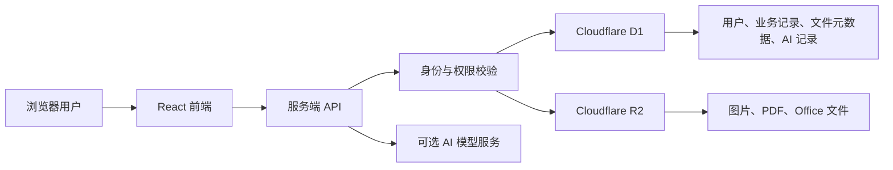

# CareerOS 系统架构

## 1. 总体结构

## 2. 请求过程

1. 用户在浏览器执行新增、编辑、删除或上传操作。
2. API 从可信登录请求头识别当前用户，不接受前端自行提交的 `user_id`。
3. 后端创建或读取内部用户编号。
4. SQL 查询同时包含资源编号和用户编号。
5. 结构化数据写入 D1；文件内容写入 R2，文件元数据写入 D1。
6. AI 功能由用户主动触发，结果经过字段校验和用户确认后才能应用。

## 3. 环境划分

私人版与公开版使用相同代码，但绑定不同的 D1 和 R2。环境隔离能够避免部署配置错误时公开真实求职数据。

## 4. 可维护性设计

- 数据库变化使用版本化 SQL 迁移。
- 身份校验放在服务端公共模块中。
- AI 通过统一适配层调用，可替换服务商。
- AI 原始内容与整理建议分开保存，失败不会覆盖用户内容。
- MVP 先使用通用业务表，稳定后再拆分标准业务表。
