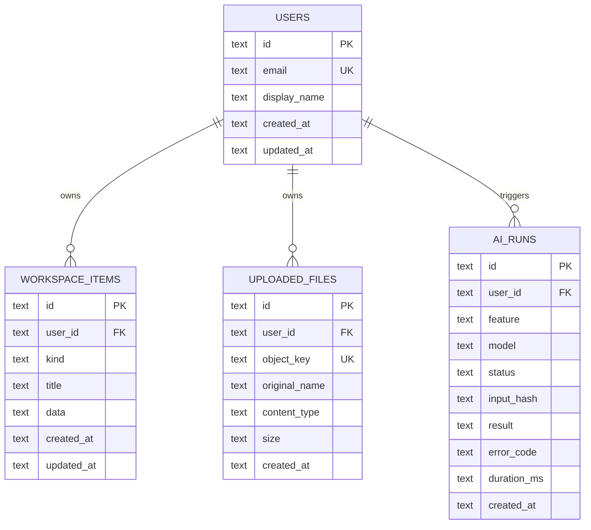

# 数据库设计与 ER 图

## 1. 当前 MVP 数据表

## 2. 字段翻译

### `users`：用户表

| 英文字段 | 中文解释 |
|---|---|
| `id` | 用户内部编号，主键且不能重复 |
| `email` | 登录邮箱，不能重复 |
| `display_name` | 页面显示名称 |
| `created_at` | 账号首次创建时间 |
| `updated_at` | 账号资料最后更新时间 |

### `workspace_items`：通用业务记录表

| 英文字段 | 中文解释 |
|---|---|
| `id` | 记录编号，主键且不能重复 |
| `user_id` | 所属用户编号，关联用户表 |
| `kind` | 记录类型，例如任务、岗位、资料或随手记 |
| `title` | 记录标题 |
| `data` | 当前 MVP 的详细业务字段，使用 JSON 文本保存 |
| `created_at` | 创建时间 |
| `updated_at` | 最后修改时间 |

### `uploaded_files`：上传文件元数据表

| 英文字段 | 中文解释 |
|---|---|
| `id` | 文件记录编号 |
| `user_id` | 文件所属用户 |
| `object_key` | 文件在 R2 中的唯一存储位置 |
| `original_name` | 用户上传时的原始文件名 |
| `content_type` | 文件格式，例如图片或 PDF |
| `size` | 文件大小 |
| `created_at` | 上传时间 |

### `ai_runs`：AI 调用记录表

| 英文字段 | 中文解释 |
|---|---|
| `id` | 本次 AI 调用编号 |
| `user_id` | 发起调用的用户 |
| `feature` | 调用功能，例如 JD 整理或笔记整理 |
| `model` | 使用的模型名称 |
| `status` | 成功或失败状态 |
| `input_hash` | 输入内容摘要值，用于识别重复内容，不是原文 |
| `result` | 经过校验后的结构化结果 |
| `error_code` | 失败时的错误代码 |
| `duration_ms` | 调用耗时，单位毫秒 |
| `created_at` | 调用时间 |

## 3. 后续标准化迁移

升级版将新增 `tasks`、`job_applications`、`notes`、`resources`、`resource_folders`、`tags` 等业务表。迁移步骤为：备份旧数据、建立新表、按 `kind` 读取 JSON、写入新表、核对数量、双读验证、切换 API、保留旧表作为回滚备份。
